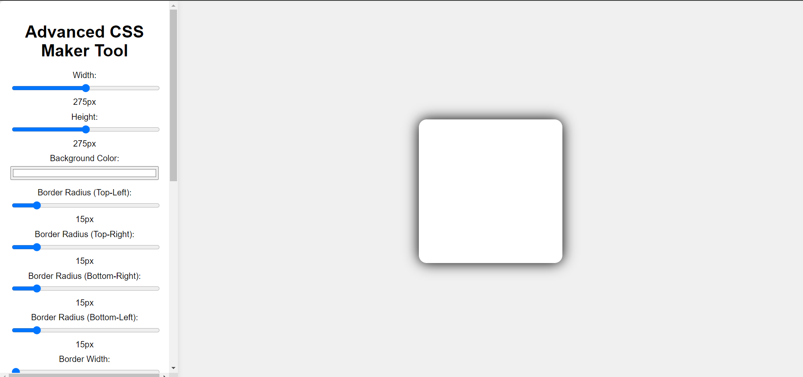
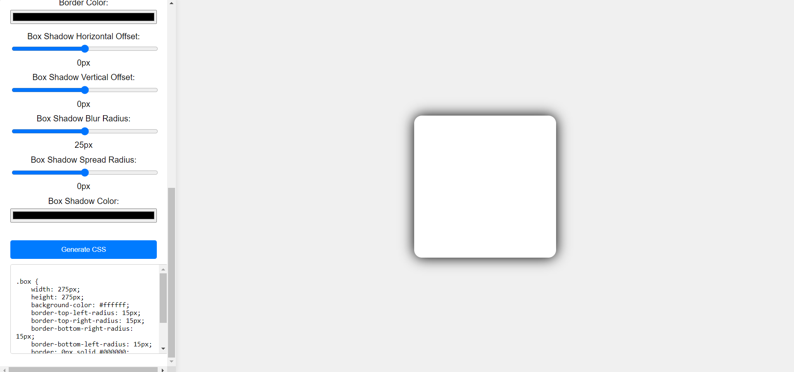

# Advanced CSS Maker Tool


Welcome to the **Advanced CSS Maker Tool**! This tool allows you to easily customize the styling of a box element using a variety of CSS properties. The tool provides a user-friendly interface for adjusting width, height, background color, border radius, border width, border color, and box shadow.

## Table of Contents

- [Features](#features)
- [Getting Started](#getting-started)
- [Usage](#usage)
- [Contributing](#contributing)
- [License](#license)
- [Screenshots](#screenshots)

## Features

- **Dynamic Styling**: Adjust the width, height, background color, and more in real-time.
- **Border Customization**: Modify border width, color, and radius for each corner.
- **Box Shadow**: Customize the box shadow with horizontal and vertical offsets, blur radius, spread radius, and color.
- **Live Preview**: See the changes instantly on the box element.
- **CSS Code Generation**: Generate the CSS code for the customized styles.

## Getting Started

### Prerequisites

To run this project, you need a modern web browser. No additional software or libraries are required.

### Installation

1. Clone the repository:
   ```sh
   git clone https://github.com/your-username/advanced-css-maker-tool.git
   ```
2. Navigate to the project directory:
   ```sh
   cd advanced-css-maker-tool
   ```

### Running the Tool

Open `index.html` in your web browser to start using the Advanced CSS Maker Tool.

## Usage

1. **Adjust Properties**: Use the sliders and color pickers on the left sidebar to customize the box element.
2. **Preview Changes**: The box element in the center of the screen updates in real-time to reflect your changes.
3. **Generate CSS**: Click the "Generate CSS" button to get the CSS code for your customized styles. The code will appear in the textarea below the button, ready to be copied and used in your projects.

## Contributing

We welcome contributions to improve this tool! To contribute, follow these steps:

1. Fork the repository.
2. Create a new branch:
   ```sh
   git checkout -b feature/your-feature-name
   ```
3. Make your changes.
4. Commit your changes:
   ```sh
   git commit -m 'Add your feature description'
   ```
5. Push to the branch:
   ```sh
   git push origin feature/your-feature-name
   ```
6. Open a pull request.

## License

This project is licensed under the MIT License. See the [LICENSE](LICENSE) file for details.

## Screenshots


_Preview of the Advanced CSS Maker Tool with default settings._


_Preview of the tool with customized settings._
